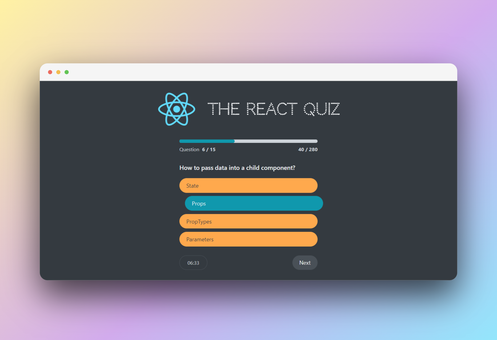

# A small React Quiz using react js

## Getting Started

To run this project locally, follow these steps:

1. Install project dependencies:

   ```bash
   npm install
   ```

2. Start the fake JSON server to host the questions data:

```bash
   npm run server
```

3. Start the React app:
   `npm start`
